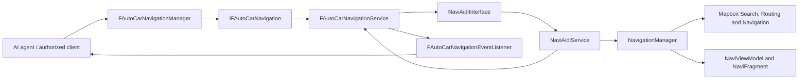
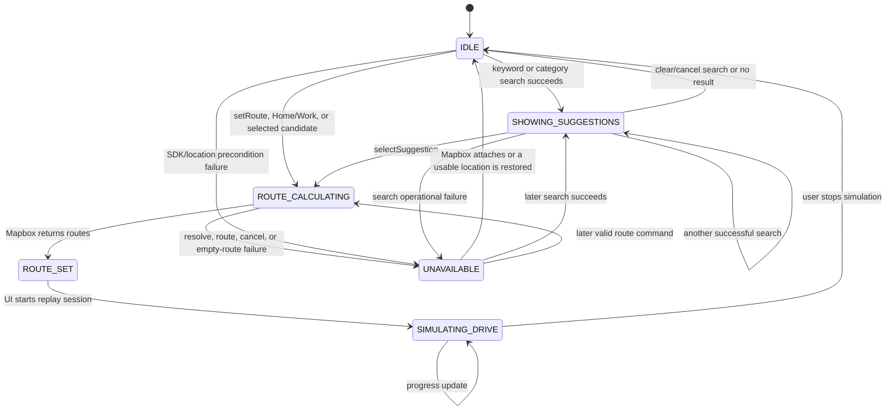
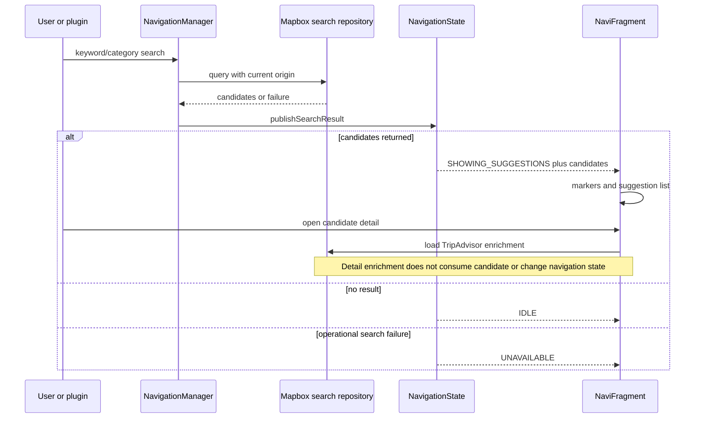
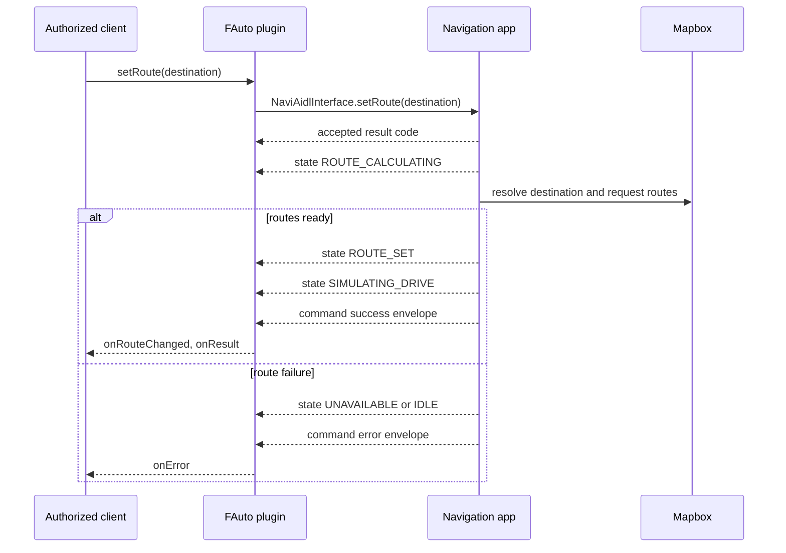
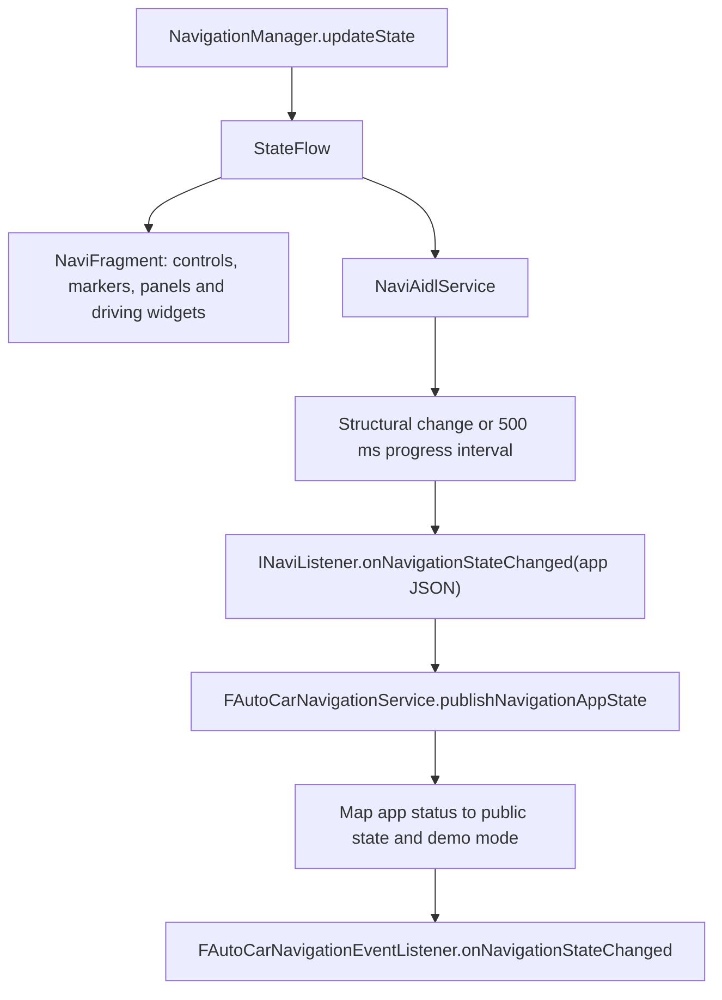
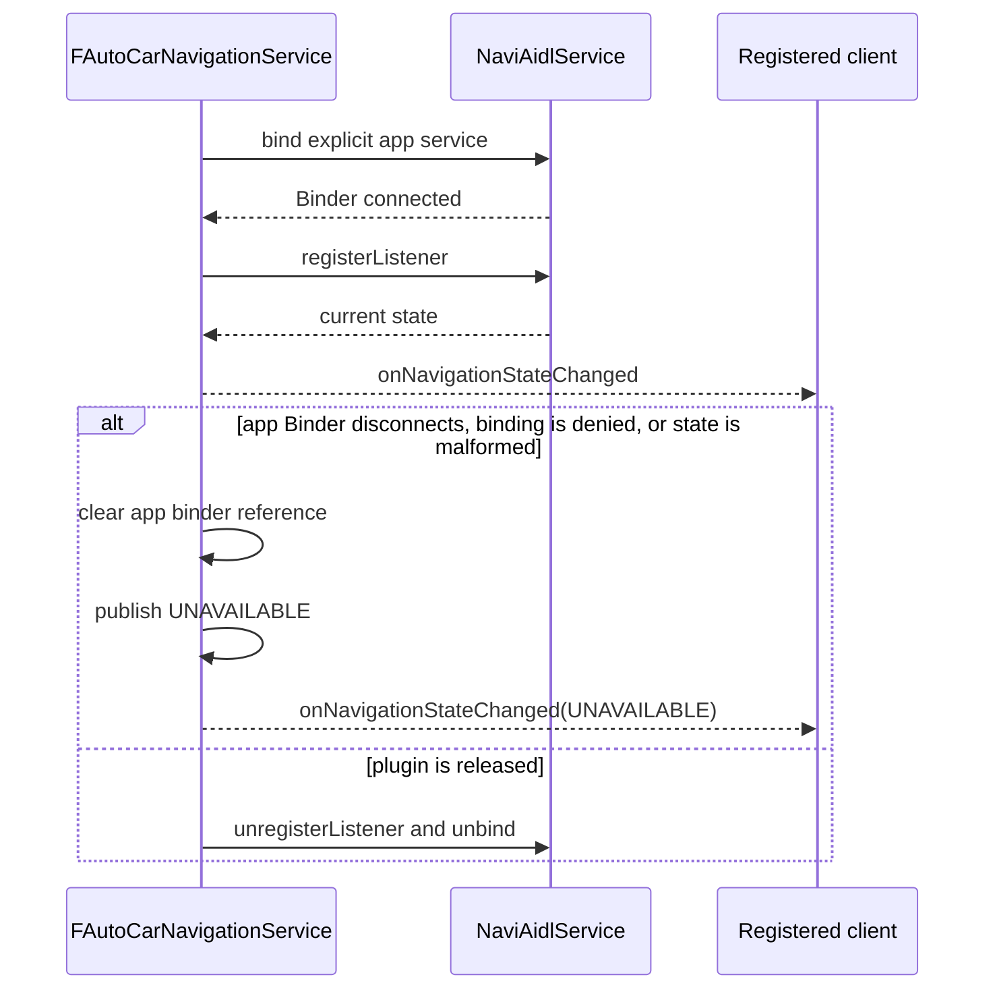

# Navigation application and plugin architecture

## Purpose and boundary

The navigation application remains a normal Mapbox navigation application. It owns its UI, Mapbox search, route calculation, route rendering, and replay simulation. The FAuto plugin is an IPC adapter for an external caller such as an AI agent; it does not reimplement navigation behavior.

The two processes communicate over Binder. The plugin exposes the stable `fauto.car.navigation` contract and consumes the application's private `com.ivi.car.navigation` contract. The application's `NaviAidlService` is deliberately a thin adapter over `NavigationManager`.

## Application

| Layer | Main source | Responsibility |
| --- | --- | --- |
| UI | `ui/NaviFragment.kt`, `ui/NaviViewModel.kt` | Displays the map/search/details and owns Mapbox navigation attachment, route display, maneuver/ETA UI and replay start/stop. |
| Domain/controller | `controller/NavigationManager.kt` | Single process authority for search, candidate selection, saved Home/Work, route requests, navigation state and replay-speed mode. |
| Contract/model | `model/NavigationContract.kt` | Stable app result codes, states, suggestions and asynchronous `NavigationCommandEvent` envelopes. |
| App Binder adapter | `service/NaviAidlService.kt` | Implements `NaviAidlInterface`; forwards commands to `NavigationManager` and broadcasts state plus asynchronous command outcomes. |
| Mapbox integration | `repository/NavigationSearchRepository.kt` and UI Mapbox setup | Resolves text/category places, creates routes and runs navigation simulation. |

`NavigationManager` does not make UI decisions. It publishes `NavigationState` for the UI and publishes a command outcome only when an asynchronous route request has either produced routes or failed. This avoids reporting `setRoute`/`selectSuggestion`/`startNavigatingHome` as successful merely because the command was accepted.

Home and Work are application data. The UI can replace either saved location after confirmation; plugin `startNavigatingHome()` uses the same stored Home destination.

Map style and demo mode are separate concerns. UI map-style selection stays local to the application. `setNavigationDemoMode()` changes Mapbox replay speed through the existing controller/view-model flow: normal `1.0x`, traffic jam `0.5x`, highway `2.0x`.

## Plugin

| Layer | Main source | Responsibility |
| --- | --- | --- |
| Client API | `lib/src/fauto/car/navigation/FAutoCarNavigationManager.java` | System-client manager, permission checks, input validation and main-thread listener dispatch. |
| Public Binder service | `service/src/com/fauto/car/navigation/FAutoCarNavigationService.java` | Implements `IFAutoCarNavigation`, binds to the app and translates app data/errors into the public callback schema. |
| Public AIDL | `lib/aidl/fauto/car/navigation/IFAutoCarNavigation.aidl` | API consumed by the authorized client. |
| App-client AIDL | `service/src/com/ivi/car/navigation/*.aidl` | Private client-side copy of the app Binder contract. It must remain descriptor-identical to the app AIDL or be replaced by a common contract artifact. |

The plugin does not create mock candidates or mock routes. It forwards all real navigation work to the application. `FAutoCarNavigationService` preserves its framework `HandlerThread` message contract: `0xA000`–`0xA005` remain the internal routing units. Oneway operations remain asynchronous; commands with an `int` return use a handler result handshake so the Binder caller receives the actual forwarding result without bypassing the handler architecture. A command that has not started within the queue timeout is cancelled; once started, it returns the actual forwarding result. Later navigation outcomes are still delivered through callbacks.

## API and callback behavior

| Plugin API | App operation | Completion callback |
| --- | --- | --- |
| `setRoute(destination)` | Resolve the top Mapbox match and request routes | `onNavigationStateChanged`, `onRouteChanged`, then `onResult`; failure uses `onError`. |
| `getSearchNearbyCategory(category, limit, sortedBy)` | Convert plugin category/sort constants, then call `searchNearBy` | `onSearchNearByCategory`; invalid/failed search uses `onError`. |
| `selectSuggestion(suggestionId)` | Select an ID from the last application search and request routes | Same route callbacks as `setRoute`. |
| `getNavigationState()` | Read the current app state JSON | Synchronous string result. |
| `setNavigationDemoMode(mode)` | Set existing replay-speed mode | `onNavigationDemoModeChanged` and the state callback. |
| `startNavigatingHome()` | Route to the application's stored Home | Same route callbacks as `setRoute`. |
| `sendDataTurnByTurn(data)` | Preserve the existing opaque turn-by-turn transport | `onResult` or `onError`. |

For route commands, `RESULT_OK` means the request was accepted for asynchronous calculation. A later success callback means the driving simulation has started. The app's detailed error codes are preserved in callback JSON as `appResultCode`; the plugin maps them to the public result-code set (`ERROR_UNAVAILABLE`, `ERROR_VALUE_INVALID`, `ERROR_REMOTE_EXCEPTION`, `ERROR_OPERATION_FAILED`).

## Complete navigation state flow

`NavigationManager.state` is the single application `StateFlow`. Every mutation goes through `updateState`, which increments `version`. The state JSON includes the status, selected destination, active suggestions, saved Home/Work, internal map style, demo mode and replay speed, trip progress, a human-readable message, and the monotonically increasing version.

`NaviFragment` observes it for visual state; `NaviAidlService` observes it for IPC. Neither consumer owns or mutates the state.

| Application state | Entered by | UI behavior | Plugin projection / exit |
| --- | --- | --- | --- |
| `IDLE` | Initial state; clear search after suggestions; stop simulation; recovery after navigation attaches or location becomes available. | Search, Home/Work, and category shortcuts are available; navigation cards are hidden. | Plugin reports `IDLE`. A search, route request, or lifecycle failure changes state. |
| `SHOWING_SUGGESTIONS` | Successful keyword or nearby search through `publishSearchResult`. | Search panel and map markers show candidates; the user may open details or select a candidate. | Plugin reports `SHOWING_SUGGESTIONS`; nearby plugin queries additionally deliver `onSearchNearByCategory`. Select, clear, or a failed search exits it. |
| `ROUTE_CALCULATING` | A route command begins resolving a text/autocomplete destination or sends a Mapbox route request. | Search is blocked/hidden and the destination marker is displayed. | Plugin reports `ROUTE_CALCULATING`. It transitions to `ROUTE_SET` only when Mapbox returns non-empty routes; resolving/routing failure goes to `UNAVAILABLE`. |
| `ROUTE_SET` | `NavigationRouterCallback.onRoutesReady` receives one or more routes and calls `setNavigationRoutes`. | Map and destination remain visible; navigation widgets become visible. | Plugin reports `ROUTE_SET` and emits `onRouteChanged` once for this route. The UI then starts replay and moves state to `SIMULATING_DRIVE`. |
| `SIMULATING_DRIVE` | `NaviViewModel.startSimulation` starts Mapbox replay; later progress updates retain this state. | Maneuver, speed-limit, ETA, and trip-progress widgets are visible. Search and shortcut controls remain hidden until navigation stops. | Plugin reports `SIMULATING_DRIVE`; state JSON contains the latest distance/duration remaining. It does not emit a second route-change callback for the same route transition. |
| `UNAVAILABLE` | Navigation SDK absent, location absent during a route command, failed route request, failed destination confirmation, or an operational search failure. | Search area remains available with an unavailable hint; driving widgets are hidden. | Plugin maps to `UNAVAILABLE`. Recovering Mapbox attachment/location can return to `IDLE`; a later valid search/route can proceed normally. |

### State transition map

`ROUTE_SET` is intentionally short-lived: route readiness belongs to `NavigationManager`, while starting replay belongs to the existing UI/Mapbox lifecycle. This preserves normal in-app behavior and prevents a plugin command from starting a second simulation engine.

### Search and detail flow

Invalid category/sort/limit and a nearby-search call with no current location return a detailed `NavigationSearchResult` without replacing the currently displayed application state. The public plugin converts those result codes into `onError`; this avoids wiping an existing UI search/detail merely because an external caller sent invalid input.

The searchable candidate map is held by `NavigationManager` and indexed by stable `suggestionId`. `selectSuggestion` consumes the selected item only after it is found; detail loading leaves it intact. This is why viewing a detail can be followed by Directions, while a stale or already-consumed identifier returns an appropriate command error.

### Route-command flow and callback ordering

The synchronous integer return only represents validation and command acceptance. The final command outcome is deliberately asynchronous:

1. `setRoute`, `selectSuggestion`, or `startNavigatingHome` returns `RESULT_OK` only after immediate app validation passes.
2. The app broadcasts `ROUTE_CALCULATING` through `onNavigationStateChanged`.
3. On non-empty Mapbox routes, the app broadcasts `ROUTE_SET`. The plugin raises `onRouteChanged` once for this transition.
4. When the UI starts Mapbox replay, the app broadcasts `SIMULATING_DRIVE` and emits the `navigation-command/SUCCESS` data envelope. The plugin transforms that envelope into `onResult`.
5. On autocomplete resolution failure, cancellation, router failure, or no routes, the app broadcasts `UNAVAILABLE` and emits a `navigation-command/ERROR` envelope; the plugin delivers `onError` with both public `resultCode` and detailed `appResultCode`.

Immediate failures such as an empty destination, unknown suggestion ID, no saved Home, no current location, or a disconnected app return a non-zero code directly. The plugin also emits `onError` for those paths, so callers do not need to poll state to detect a rejected command.

### State broadcast, rate limiting, and plugin mapping

The app service broadcasts every structural change (status, destination, suggestion IDs, map style, demo mode, or message). Progress-only updates are coalesced to at most one broadcast per 500 ms. When a listener registers it immediately receives the current state JSON. `getNavigationState()` is read-only and does not emit a state callback.

The plugin maps names exactly as follows:

| App `NavigationStatus` | Plugin `NavigationState` |
| --- | --- |
| `IDLE` | `NAVIGATION_STATE_IDLE` |
| `SHOWING_SUGGESTIONS` | `NAVIGATION_STATE_SHOWING_SUGGESTIONS` |
| `ROUTE_CALCULATING` | `NAVIGATION_STATE_ROUTE_CALCULATING` |
| `ROUTE_SET` | `NAVIGATION_STATE_ROUTE_SET` |
| `SIMULATING_DRIVE` | `NAVIGATION_STATE_SIMULATING_DRIVE` |
| `UNAVAILABLE`, empty/invalid state, or disconnected application | `NAVIGATION_STATE_UNAVAILABLE` |

The plugin retains the full original application JSON as `appState` inside its public state JSON. It also mirrors the active destination, suggestion ID, last nearby category/limit/sort, and current demo mode. A demo-mode change is detected from application state, emits `onNavigationDemoModeChanged`, then continues through the ordinary state callback.

### Binder lifecycle and unavailable state

The plugin never fabricates a route or nearby result during a disconnected state. It reports `ERROR_UNAVAILABLE` for commands/queries that cannot reach the app and keeps the published state at `UNAVAILABLE` until a valid app state arrives.

### App-only entry points that use the same state machine

The normal UI can also start a route from a map tap/manual origin (`findRoute`) or Work shortcut (`startNavigatingWork`). These do not have a public plugin API, but use the same `requestRoute` callback and therefore follow `ROUTE_CALCULATING → ROUTE_SET → SIMULATING_DRIVE`, or `UNAVAILABLE` on routing failure. Stopping the replay session clears Mapbox routes and rebuilds `IDLE` while preserving Home, Work, map style, and demo mode.

## Contract and build constraints

The `com.ivi.car.navigation` AIDL declarations are intentionally duplicated in the app and plugin source because both need generated stubs with the same Binder descriptor. A shared AIDL/JAR artifact can later replace this duplication, but only if both builds consume exactly the same package/name/signatures.

This repository snapshot contains the app/plugin source but no Gradle wrapper, Gradle settings, or AOSP build environment. Consequently this change is checked with static contract/structure checks and `git diff --check`; it has not been compiled in this repository. Compile it from the owning Android/AOSP build environment before integration testing on an emulator or board.
