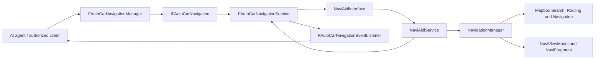
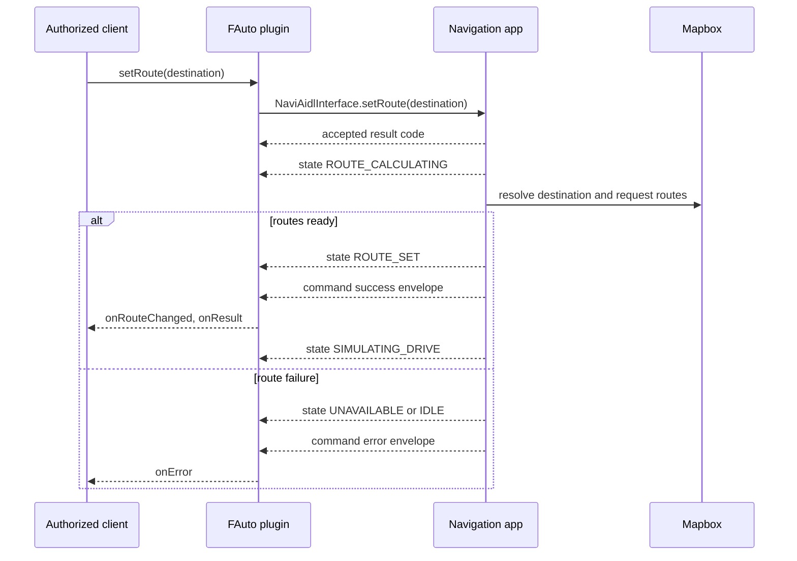

# Navigation application and plugin architecture

## Purpose and boundary

The navigation application remains a normal Mapbox navigation application. It owns its UI, Mapbox search, route calculation, route rendering, and replay simulation. The FAuto plugin is an IPC adapter for an external caller such as an AI agent; it does not reimplement navigation behavior.

The two processes communicate over Binder. The plugin exposes the stable `fauto.car.navigation` contract and consumes the application's private `com.ivi.car.navigation` contract. The application's `NaviAidlService` is deliberately a thin adapter over `NavigationManager`.

## Application

| Layer | Main source | Responsibility |
| --- | --- | --- |
| UI | `ui/NaviFragment.kt`, `ui/NaviViewModel.kt` | Displays the map/search/details and owns Mapbox navigation attachment, route display, maneuver/ETA UI and replay start/stop. |
| Domain/controller | `controller/NavigationManager.kt` | Single process authority for search, candidate selection, saved Home/Work, route requests, navigation state and replay-speed mode. |
| Contract/model | `model/NavigationContract.kt` | Stable app result codes, states, suggestions and asynchronous `NavigationCommandEvent` envelopes. |
| App Binder adapter | `service/NaviAidlService.kt` | Implements `NaviAidlInterface`; forwards commands to `NavigationManager` and broadcasts state plus asynchronous command outcomes. |
| Mapbox integration | `repository/NavigationSearchRepository.kt` and UI Mapbox setup | Resolves text/category places, creates routes and runs navigation simulation. |

`NavigationManager` does not make UI decisions. It publishes `NavigationState` for the UI and publishes a command outcome only when an asynchronous route request has either produced routes or failed. This avoids reporting `setRoute`/`selectSuggestion`/`startNavigatingHome` as successful merely because the command was accepted.

Home and Work are application data. The UI can replace either saved location after confirmation; plugin `startNavigatingHome()` uses the same stored Home destination.

Map style and demo mode are separate concerns. UI map-style selection stays local to the application. `setNavigationDemoMode()` changes Mapbox replay speed through the existing controller/view-model flow: normal `1.0x`, traffic jam `0.5x`, highway `2.0x`.

## Plugin

| Layer | Main source | Responsibility |
| --- | --- | --- |
| Client API | `lib/src/fauto/car/navigation/FAutoCarNavigationManager.java` | System-client manager, permission checks, input validation and main-thread listener dispatch. |
| Public Binder service | `service/src/com/fauto/car/navigation/FAutoCarNavigationService.java` | Implements `IFAutoCarNavigation`, binds to the app and translates app data/errors into the public callback schema. |
| Public AIDL | `lib/aidl/fauto/car/navigation/IFAutoCarNavigation.aidl` | API consumed by the authorized client. |
| App-client AIDL | `service/src/com/ivi/car/navigation/*.aidl` | Private client-side copy of the app Binder contract. It must remain descriptor-identical to the app AIDL or be replaced by a common contract artifact. |

The plugin does not create mock candidates or mock routes. It forwards all real navigation work to the application. A nearby query is asynchronous; command return codes communicate immediate acceptance/validation while later results are delivered through callbacks.

## API and callback behavior

| Plugin API | App operation | Completion callback |
| --- | --- | --- |
| `setRoute(destination)` | Resolve the top Mapbox match and request routes | `onNavigationStateChanged`, `onRouteChanged`, then `onResult`; failure uses `onError`. |
| `getSearchNearbyCategory(category, limit, sortedBy)` | Convert plugin category/sort constants, then call `searchNearBy` | `onSearchNearByCategory`; invalid/failed search uses `onError`. |
| `selectSuggestion(suggestionId)` | Select an ID from the last application search and request routes | Same route callbacks as `setRoute`. |
| `getNavigationState()` | Read the current app state JSON | Synchronous string result. |
| `setNavigationDemoMode(mode)` | Set existing replay-speed mode | `onNavigationDemoModeChanged` and the state callback. |
| `startNavigatingHome()` | Route to the application's stored Home | Same route callbacks as `setRoute`. |
| `sendDataTurnByTurn(data)` | Preserve the existing opaque turn-by-turn transport | `onResult` or `onError`. |

For route commands, `RESULT_OK` means the request was accepted for asynchronous calculation. A later success callback means Mapbox returned a route. The app's detailed error codes are preserved in callback JSON as `appResultCode`; the plugin maps them to the public result-code set (`ERROR_UNAVAILABLE`, `ERROR_VALUE_INVALID`, `ERROR_REMOTE_EXCEPTION`, `ERROR_OPERATION_FAILED`).

## State and event flow

## Contract and build constraints

The `com.ivi.car.navigation` AIDL declarations are intentionally duplicated in the app and plugin source because both need generated stubs with the same Binder descriptor. A shared AIDL/JAR artifact can later replace this duplication, but only if both builds consume exactly the same package/name/signatures.

This repository snapshot contains the app/plugin source but no Gradle wrapper, Gradle settings, or AOSP build environment. Consequently this change is checked with static contract/structure checks and `git diff --check`; it has not been compiled in this repository. Compile it from the owning Android/AOSP build environment before integration testing on an emulator or board.
